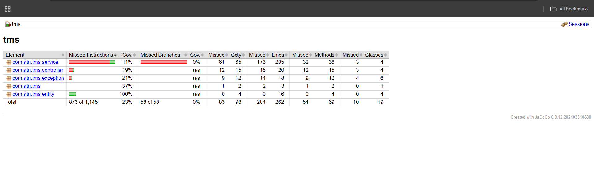
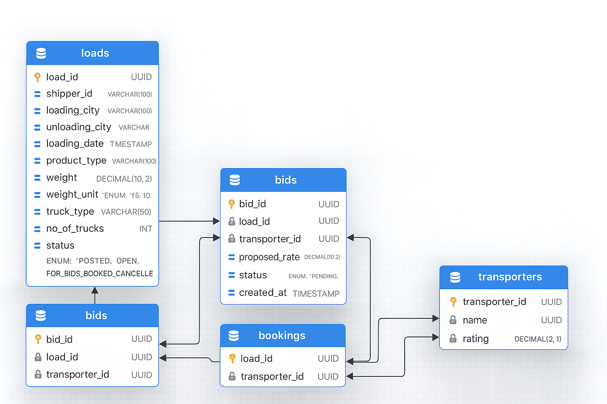

# Transport Management System (TMS)

## 📝 Project Overview

This backend application implements a Transport Management System (TMS) where:

- **Shippers** can create and manage loads
- **Transporters** can bid on loads
- **System** selects best bids using scoring logic
- **Loads** can be booked/cancelled with concurrency-safe operations

This project is designed following clean architecture, REST standards, and enterprise-grade JPA design.

---

## ✨ Features

### 🚛 Load Management
- Create load
- Fetch load by ID
- Paginated load listing
- Cancel load (except booked loads)

### 💰 Bid Management
- Transporters bid with pricing & truck availability
- Score-based "best bids" ranking:
  ```
  score = (1/rate)*0.7 + (rating/5)*0.3
  ```

### 📦 Booking
- Confirms a bid
- Allocates trucks
- Prevents double booking using optimistic locking

### ✔️ Additional Features
- Swagger UI documentation
- Global Exception Handling
- DTO Validation
- Indices + Unique Constraints
- PostgreSQL relational schema

---


## 🗄️ Database Schema Diagram

```
┌──────────────────────────┐
│         LOADS            │
├──────────────────────────┤
│ load_id (UUID) PK        │
│ shipper_id               │
│ loading_city             │
│ unloading_city           │
│ loading_date             │
│ product_type             │
│ weight                   │
│ weight_unit (ENUM)       │
│ truck_type               │
│ no_of_trucks             │
│ status (ENUM)            │
│ date_posted              │
│ version (BIGINT)         │
└─────────────┬────────────┘
              │ 1 → N
┌──────────────────────────┐
│          BIDS            │
├──────────────────────────┤
│ bid_id (UUID) PK         │
│ proposed_rate            │
│ trucks_offered           │
│ status (ENUM)            │
│ submitted_at             │
│ load_id (FK)             │
│ transporter_id (FK)      │
└─────────────┬────────────┘
              │ 1 → N
┌──────────────────────────┐
│        BOOKINGS          │
├──────────────────────────┤
│ booking_id (UUID) PK     │
│ allocated_trucks         │
│ final_rate               │
│ status (ENUM)            │
│ booked_at                │
│ bid_id (FK)              │
│ load_id (FK)             │
│ transporter_id (FK)      │
└──────────────────────────┘
```

---

## 🧪 Tech Stack

| Component | Technology |
|-----------|-----------|
| Backend | Spring Boot 3.5 |
| ORM | JPA + Hibernate |
| DB | PostgreSQL 18 |
| Validation | Spring Boot Starter Validation |
| Documentation | Swagger / OpenAPI |
| Testing | JUnit 5, Mockito |
| Build Tool | Maven |
| Logging | SLF4J + Logback |

---

## 📂 Folder Structure

```
src/
 ├── main/java/com/atri/tms/
 │   ├── controller/
 │   ├── service/
 │   ├── repository/
 │   ├── entity/
 │   ├── dto/
 │   └── exception/
 ├── test/java/com/atri/tms/
 ├── resources/
 │   ├── application.yml
 │   └── schema.sql (optional)
postman/
 └── TMS_API_Collection.json
README.md
```

---

## ⚙️ Setup & Installation

### 1️⃣ Clone Repository

```bash
git clone https://github.com/Atri9Ghosh/tms.git
cd tms
```

### 2️⃣ Configure application.yml

```yaml
spring:
  datasource:
    url: jdbc:postgresql://localhost:5432/tms
    username: postgres
    password: postgres
  jpa:
    hibernate:
      ddl-auto: update
```

### 3️⃣ Run Application

```bash
mvn clean install
mvn spring-boot:run
```

---

## 📘 API Documentation

### 📨 Postman Collection

The full API collection for this backend can be imported into Postman using the link below:

👉 **Postman Collection (JSON):**  
https://raw.githubusercontent.com/Atri9Ghosh/tms/main/postman/TMS_API_Collection.json

### 📥 Import Instructions

1. Open Postman  
2. Click **Import**  
3. Paste URL above *or* upload the file manually from:
4. You will now see the following API requests ready to use:
- Create Load  
- Get Load by ID  
- List Loads  
- Cancel Load  
- Get Best Bids
 
---

## 📬 Key API Endpoints

### Create Load
```http
POST /load
Content-Type: application/json

{
  "shipperId": "SHP-001",
  "loadingCity": "Kolkata",
  "unloadingCity": "Delhi",
  "loadingDate": "2025-12-10T10:00:00Z",
  "productType": "Electronics",
  "weight": 1200,
  "weightUnit": "KG",
  "truckType": "Open",
  "noOfTrucks": 2
}
```

### Get Load
```http
GET /load/{loadId}
```

### List Loads
```http
GET /load?shipperId=SHP-001&status=POSTED&page=0&size=10
```

### Cancel Load
```http
PATCH /load/{loadId}/cancel
```

### Best Bids
```http
GET /load/{loadId}/best-bids
```

---

## 🧪 Testing & Coverage

### Run Tests
```bash
mvn test
```

### Generate Coverage Report
```bash
mvn jacoco:prepare-agent test jacoco:report
```

### Open Report
```
target/site/jacoco/index.html
```

---

## 📊 JaCoCo Coverage Report



---

## 📊 Database Schema Visualization



---

## 🔧 Development

### Prerequisites
- Java 17 or higher
- Maven 3.8+
- PostgreSQL 18+

### Building the Project
```bash
mvn clean build
```

### Running Tests
```bash
mvn clean test
```

### Running with Coverage
```bash
mvn clean verify
```

---

## 📝 License

This project is licensed under the MIT License.

